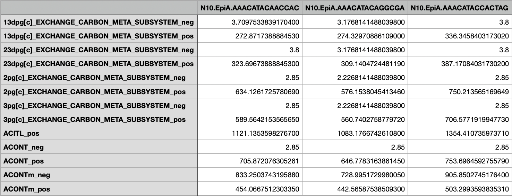

Module-Compass
==============

.. contents:: Contents
   :local:

Module-Compass Quickstart
*************************

.. code:: bash

    compass --data expression.tsv --model Human1 --species homo_sapiens --select-meta-subsystems meta_subsystems.txt --num-processes 10

COMPASS computes reaction scores for each reaction in the entire metabolic network, 
but in many cases users may only be interested in a given collection of subsystems (by which we refer to 
in this documentation as **meta-subsystems**) within the network.

The ``--select-meta-subsystems`` flag invokes Module-Compass and computes reaction scores on the 
meta-subsystems defined in a user-provided textual file. An example input file for Human1/Mouse1 is provided below:

.. code:: bash

    TRANS_META_SUBSYSTEM: Transport reactions
    CENTRAL_CARBON_META_SUBSYSTEM: Glycolysis / Gluconeogenesis; Tricarboxylic acid cycle and glyoxylate/dicarboxylate metabolism; Oxidative phosphorylation
    AA_META_SUBSYSTEM: Phenylalanine, tyrosine and tryptophan biosynthesis; Arginine and proline metabolism; Tyrosine metabolism; Folate metabolism; Glycine, serine and threonine metabolism; Valine, leucine, and isoleucine metabolism; Cysteine and methionine metabolism; Lysine metabolism; Alanine, aspartate and glutamate metabolism; Metabolism of other amino acids; Histidine metabolism; Tryptophan metabolism; Beta-alanine metabolism; Phenylalanine metabolism; Urea cycle
    LIPID_META_SUBSYSTEM: Fatty acid oxidation; Formation and hydrolysis of cholesterol esters; Arachidonic acid metabolism; Carnitine shuttle (endoplasmic reticular); Sphingolipid metabolism; Carnitine shuttle (mitochondrial); Glycerophospholipid metabolism; Steroid metabolism; Glycerolipid metabolism; Fatty acid biosynthesis; Omega-3 fatty acid metabolism; Acyl-CoA hydrolysis; Fatty acid activation (cytosolic); Cholesterol metabolism; Omega-6 fatty acid metabolism; Carnitine shuttle (cytosolic); Beta oxidation of even-chain fatty acids (mitochondrial); Fatty acid activation (endoplasmic reticular); Fatty acid metabolism; Glycosphingolipid biosynthesis-lacto and neolacto series; Beta oxidation of even-chain fatty acids (peroxisomal); Beta oxidation of unsaturated fatty acids (n-9) (peroxisomal); Beta oxidation of odd-chain fatty acids (mitochondrial); Glycosphingolipid biosynthesis-ganglio series; Linoleate metabolism; Fatty acid biosynthesis (even-chain); Fatty acid biosynthesis (unsaturated); Fatty acid biosynthesis (odd-chain); Cholesterol biosynthesis 1 (Bloch pathway); Glycosphingolipid metabolism; Propanoate metabolism; Beta oxidation of poly-unsaturated fatty acids (mitochondrial); Beta oxidation of unsaturated fatty acids (n-9) (mitochondrial); Phosphatidylinositol phosphate metabolism; Fatty acid elongation (even-chain); Beta oxidation of phytanic acid (peroxisomal); Beta oxidation of di-unsaturated fatty acids (n-6) (peroxisomal); Beta oxidation of di-unsaturated fatty acids (n-6) (mitochondrial); Beta oxidation of unsaturated fatty acids (n-7) (mitochondrial); Ether lipid metabolism; Cholesterol biosynthesis 3 (Kandustch-Russell pathway); Beta oxidation of branched-chain fatty acids (mitochondrial); Fatty acid elongation (odd-chain); Fatty acid desaturation (even-chain); Glycosphingolipid biosynthesis-globo series; Ubiquinone synthesis; Butanoate metabolism; Carnitine shuttle (peroxisomal); Beta oxidation of unsaturated fatty acids (n-7) (peroxisomal); Ubiquinone and other terpenoid-quinone biosynthesis; Lipoic acid metabolism; Cholesterol biosynthesis 2; Fatty acid desaturation (odd-chain); Beta oxidation of odd-chain fatty acids (peroxisomal); Triacylglycerol synthesis; Fatty acid degradation

An example input file for RECON2 is provided below:

.. code:: bash

    TRANS_META_SUBSYSTEM: Transport, extracellular
    CENTRAL_CARBON_META_SUBSYSTEM: Glycolysis/gluconeogenesis; Citric acid cycle; Oxidative phosphorylation
    AA_META_SUBSYSTEM: Alanine and aspartate metabolism; Arginine and Proline Metabolism; beta-Alanine metabolism; Cysteine Metabolism; D-alanine metabolism; Folate metabolism; Glutamate metabolism; Glycine, serine, alanine and threonine metabolism; Histidine metabolism; Lysine metabolism; Methionine and cysteine metabolism; Taurine and hypotaurine metabolism; Tryptophan metabolism; Tyrosine metabolism; Urea cycle; Valine, leucine, and isoleucine metabolism
    LIPID_META_SUBSYSTEM: Fatty acid oxidation; Glycerophospholipid metabolism; Fatty acid synthesis; Steroid metabolism; Sphingolipid metabolism; Triacylglycerol synthesis; Cholesterol metabolism; Propanoate metabolism; Squalene and cholesterol synthesis; Ubiquinone synthesis; Phosphatidylinositol phosphate metabolism; Butanoate metabolism

Each line in the file defines a meta-subsystem which should be formatted as:

.. code:: bash

    [META_SUBSYSTEM_ID]: [SUBSYSTEM_1]; [SUBSYSTEM_2]; ...

Note that the meta-subsystem IDs should not contain spaces. Also note that the subsystems contained in each meta-subsystem 
should be separated by semicolons.

If you are using Human1, a list of subsystems supported by Module-Compass can be found 
`here <https://github.com/YosefLab/Compass/blob/compass_v2/compass/Resources/Metabolic%20Models/Human1/core_reactions_subsystems.txt>`__.
A list of reactions supported by Module-Compass can be found
`here <https://github.com/YosefLab/Compass/blob/compass_v2/compass/Resources/Metabolic%20Models/Human1/core_reactions_md.csv>`__.

If you are using Mouse1, a list of subsystems supported by Module-Compass can be found 
`here <https://github.com/YosefLab/Compass/blob/compass_v2/compass/Resources/Metabolic%20Models/Mouse1/core_reactions_subsystems.txt>`__.
A list of reactions supported by Module-Compass can be found
`here <https://github.com/YosefLab/Compass/blob/compass_v2/compass/Resources/Metabolic%20Models/Mouse1/core_reactions_md.csv>`__.

If you are using RECON2, a list of subsystems supported by Module-Compass can be found 
`here <https://github.com/YosefLab/Compass/blob/compass_v2/compass/Resources/Metabolic%20Models/RECON2_mat/model/core_reactions_subsystems.txt>`__.
A list of reactions supported by Module-Compass can be found
`here <https://github.com/YosefLab/Compass/blob/compass_v2/compass/Resources/Metabolic%20Models/RECON2_mat/model/core_reactions_md.csv>`__.

Module-Compass Output
***********************

The output of Module-Compass should be similar to the following:

.. code:: bash

    |-- <output-dir>
    |   |-- <temp-dir>
    |   |   |-- <META_SUBSYSTEM_ID_1>
    |   |   |-- <META_SUBSYSTEM_ID_2>
    |   |-- <META_SUBSYSTEM_ID_1>
    |   |-- <META_SUBSYSTEM_ID_2>
    |   |-- compass.log
    |   |-- meta_subsystem_cache
    |   |   |-- <META_SUBSYSTEM_ID_1>
    |   |   |-- <META_SUBSYSTEM_ID_2>
    |   |-- meta_subsystem_models
    |   |   |-- <META_SUBSYSTEM_ID_1>
    |   |   |-- <META_SUBSYSTEM_ID_2>

``<temp-dir>`` contains the intermediate results for each meta-subsystem, similar to a regular Compass run.

``<META_SUBSYSTEM_ID>`` folders contain the ``reactions.tsv`` file that contains reactions scores for reactions 
in each meta-subsystem.

``meta_subsystem_cache`` contains the optimal reaction flux for each reaction. Optimal fluxes are computed agnostic of gene expression
and are only based on the connectivity of reactions within the metabolic network. Please refer to the manuscript for a 
detailed treatment of the inner workings of Compass.

``meta_subsystem_models`` contains the reactions directly associated with the meta-subsystem, their one-hop neighbors, and 
relevant exchange reactions. The format may differ between various choices of metabolic model (e.g. RECON2 or Human1), 
but should be similar to the corresponding comprehensive model under the 
`Metabolic Models <https://github.com/YosefLab/Compass/blob/compass_v2/compass/Resources/Metabolic%20Models>`__
directory.

An example ``reactions.tsv`` output file is shown below:

For each meta-subsystem, Module-Compass computes reaction scores for two types of reactions: those that are directly 
associated with the meta-subsystem, as well as exchange reactions for metabolites associated with these reactions. 
The former are labeled based on their reaction IDs in the metabolic model, while the latter are formatted as 
``<MET_ID>_EXCHANGE_<META_SUBSYSTEM_ID>``. The metadata for these reactions can be found under the corresponding folder 
for the meta-subsystem of interest within the ``meta_subsystem_models`` directory.

Module-Compass Explained
**************************

To support running COMPASS on a subset of the network, we hereby provide Module-Compass, an algorithm
that treats user-defined meta-subsystems as individual networks but still provides the necessary context 
to ensure that this simplification of the network is reasonable.

More specifically, each meta-subsystem is defined as a collection of subsystems that the user chooses. 
We construct the network for each meta-subsystem by first taking all reactions associated with the subsystems within 
the given meta-subsystems, then taking their one-step neighbor reactions, and finally adding exchange reactions for 
all metabolites associated with the collection of reactions we constructed above. The neighboring reactions provides 
necessary context to the meta-subsystem to ensure a reasonable output, while the exchange reactions enables us to 
treat the constructed network as one that is able to interface with the surrounding environment 
and uptake/secrete metabolites.

One thing to note is that the ``--select-reactions`` and ``--select-subsystems`` flags also allow users to specify 
a list of reactions and subsystems to compute COMPASS on. However, Module-Compass differs fundamentally from these 
methods. ``--select-reactions`` and ``--select-subsystems`` both operate on the entire metabolic network, meaning that the 
computation of each reaction score is still constrained by all reactions in the entire metabolic network. This requires 
the linear solver to optimize for all variables (reactions). On the other hand, Module-Compass treats meta-subsystems as 
standalone networks, drastically reducing the number of variables in the linear optimization problem and therefore 
resulting in significant speedups.
