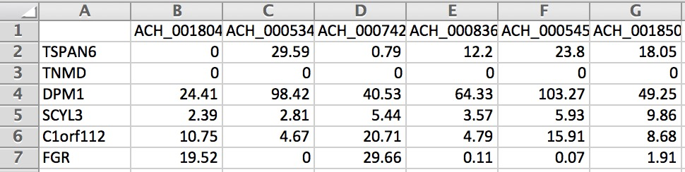
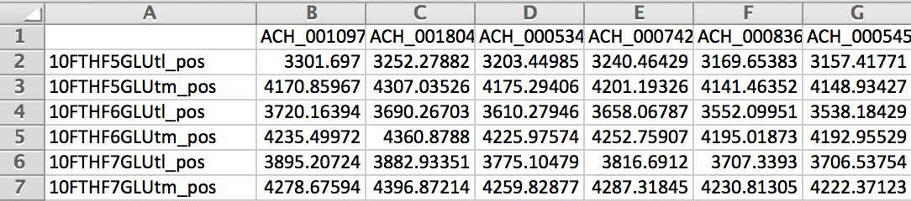

Quickstart
============

.. contents:: In this page
   :local:

Broadly speaking, Compass takes in a gene expression matrix scaled for library depth (e.g., CPM) 
and outputs a reaction score matrix, where higher scores correspond to a reaction being **less** likely.

Input Data
***********

The input gene expression matrix can be either a tab-delimited text file (tsv) or a matrix market format (mtx) 
containing gene expression estimates (CPM, TPM, or similar scaled units) with one row per gene, one column per sample.

Tab-delimited files need row and column labels corresponding to genes and sample names. 
Market matrix formats need a separate tab delimited file of of gene names and optionally a tab delimited file of cell names.

Example Input
--------------

You can find example inputs in tab-delimited format (tsv) and market matrix format (mtx) 
on this github repo under `compass/Resources/Test-Data <https://github.com/YosefLab/Compass/tree/compass_v2/compass/Resources/Test-Data>`__.

These files will exist locally as well under the Compass install directory which can be found by running:

.. code:: bash

    compass --example-inputs --species homo_sapiens

Human or mouse species makes no difference for this command.

Running Compass
***************

After opening a command line in a directory with an input file “expression.tsv”, 
you can run Compass on the data with the following command, which will limit the number of processes used to 10:

.. code:: bash

    compass --data expression.tsv --num-processes 10 --species homo_sapiens

And to run Compass on mtx formatted data use the following:

.. code:: bash

    compass --data-mtx expression.mtx genes.tsv sample_names.tsv --num-processes 10 --species homo_sapiens

Though the sample names file can be omitted, in which case the samples will be labelled by index.

Below is an example of the formatting for gene expression (we only show a small portion of the matrix):

For the first run of Compass on a given model and media there will be overhead building up the Compass cache. 
Compass will automatically build up the cache if it is empty, but you can also manually build up the cache 
before running Compass with:

.. code:: bash

    compass --precache --species homo_sapiens

.. note::

    For every individual sample, Compass takes roughly 30 minutes to calculate the reaction penalties 
    (varying by machine). This can be expedited by running more than one process at once. 
    In addition, Compass saves the results of all samples that it has already processed in the _tmp directory. 
    Therefore, Compass can also be stopped and restarted after it is done processing a subset of samples 
    so long as the _tmp directory is still there.

For an in-depth explanation of the various Compass parameters, see `here <https://compass-sc.readthedocs.io/en/latest/settings.html>`__.

Output
*******

When Compass has completed, the outputs for all samples are stored in a tab delimited file reactions.tsv 
in the specified output directory (. directory when running Compass by default).

Below is an example of the output matrix:

To get more context on what the reaction identifiers are, you can visit `virtual metabolic human <https://www.vmh.life/#home>`__ 
or the `resources directory <https://github.com/YosefLab/Compass/tree/compass_v2/compass/Resources/Recon2_export>`__ 
of Compass where there are several .csv files which include information on the reactions in Recon2.

.. note::
    While Compass is running, it will store partial results for each sample in the _tmp directory/ 
    (or the directory following --temp-dir)

Postprocessing
***************

Once Compass has finished running, we apply several steps of postprocessing to the data. 
More specifically, postprocessing converts reaction penalties (where high values correspond to low likelihood reactions) 
to reaction scores (where high values correspond to likely reactions). 
Refer to `this page <https://compass-sc.readthedocs.io/en/latest/notebooks/postprocessing.html>`__ 
of the documentation for an example notebook.