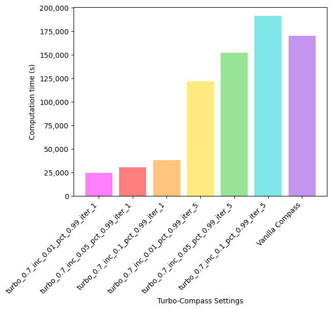
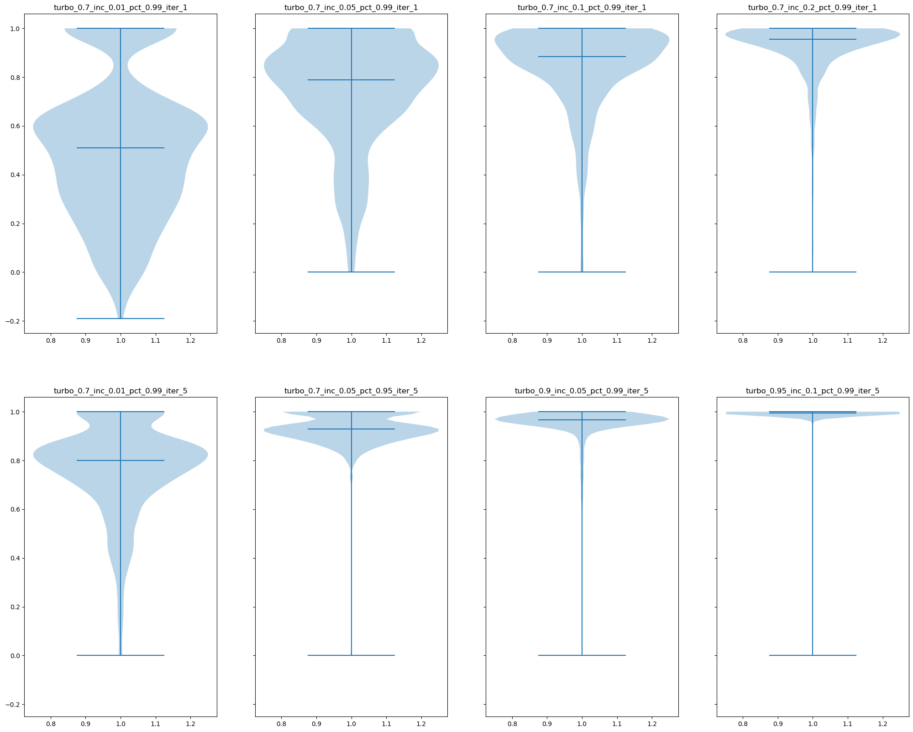

Turbo-Compass
==============

Turbo-Compass Settings
**********************

**\-\-turbo** [MIN_SR2]
    If you are willing to sacrifice some accuracy in favor of speed, you can run Compass with the ``--turbo`` 
    parameter specifying the minimum tolerated Spearman R2 (MIN_SR2) of the output matrix compared to the ground
    truth Compass matrix. This option is mutually exclusive with ``--calc-metabolites``. 
    By default MIN_SR2=1.0, i.e. no approximation is performed.

**\-\-turbo-increments** [INC]
    Turbo Compass runs by incrementally computing subsets of the reaction score matrix and using these subsets to
    impute the final reaction score matrix. This argument indicates what percentage is computed in each iteration. 
    Default value is INC=0.01.

**\-\-turbo-min-pct** [MIN_PCT]
    The minimum tolerated Spearman R2 (SR2) for MIN_PCT of the reactions. 
    Requiring 100% of reactions to meet the SR2 condition is typically too stringent since there always being 
    some reactions that fail to meet this condition. In general, decreasing this argument will 
    cause Compass to run faster but produce more reactions that violate the SR2 condition. 
    The default MIN_PCT=0.99 is enough to fix this artifact without compromising the reconstruction quality.

**\-\-turbo-max-iters** [MAX_ITERS]
    Maximum number of iterative matrix completion steps. During each iteration, INC percent of the reaction score matrix
    will be sampled and used to impute the reaction score matrix. If MIN_PCT of entries achieve a Spearman R2 that is
    higher than MIN_SR2, then Turbo-Compass will move on to the imputation of the final reaction score matrix without
    completing all MAX_ITERS iterations.

Recommended Settings
**********************************

Different dataset sizes require the use of different Turbo-Compass parameters to strike the right balance between 
runtime speedup and accuracy. In this section, we provide some rough guidelines on how to choose the best set of parameters.

**Scenario 1: dataset contains < 1,000 samples**

For smaller datasets, running vanilla Compass without any speedup is usually the best choice. Although Turbo-Compass does 
yield significant speedups, the accuracy on small dataset is not usually very high. For completeness,
here is a set of recommended parameters if you would still like to speed up your COMPASS run:

**--turbo 0.7**
**--turbo-increments 0.1**
**--turbo-min-pct 0.99**
**--turbo-max-iters 1**

This set of parameters is chosen based on experiments conducted on the `Th17 dataset 
<https://github.com/YosefLab/Compass/blob/compass_v2/docs/notebooks/extdata/Th17/linear_gene_expression_matrix.tsv>`__ 
which contains 290 samples. The runtime and accuracy of various Turbo-Compass parameters are shown here:

As shown, the runtime of running Turbo-Compass for 5 iterations is comparable to that of running vanilla Compass. 
Therefore, we suggest that the user simply run 1 iteration of Turbo-Compass along with a relatively large subset 
of the matrix, e.g. 10% (--turbo-increments 0.1).

**Scenario 2: dataset contains 1,000 ~ 10,000 samples**

For medium-size datasets, Turbo-Compass yields significant speedups while still achieving relatively high accuracy. 
The recommended set of parameters to use is:

**--turbo 0.7**
**--turbo-increments 0.05**
**--turbo-min-pct 0.99**
**--turbo-max-iters 1**

This set of parameters is chosen based on experiments conducted on the `glucose dataset 
<https://github.com/YosefLab/Compass/blob/compass_v2/docs/notebooks/extdata/glucose/normalized_expression.tsv>`__ 
which contains around 5,000 samples. The runtime and accuracy of various Turbo-Compass parameters are shown here:

Compared to running on the Th17 dataset, running Turbo-Compass on the glucose dataset yields higher accuracy.
We suggest that the user start with running 1 iteration of Turbo-Compass on 5% of the matrix (--turbo-increments 0.05), 
and if runtime permits, crank up the fraction of entries sampled as well as the number of iterations for better 
reconstruction quality.

**Scenario 3: dataset contains > 10,000 samples**

For large-scale datasets, we suggest that the user perform pseudobulking, i.e. aggregation of the expression values
from a group of cells with shared characteristics, such as cells from the same patient, replicate, cell type, etc.,
on the dataset before proceeding to use Compass. Although this process is highly dependent on the experiments 
performed to generate the dataset, we provide a `tutorial on pseudobulking 
<https://compass-sc.readthedocs.io/en/latest/notebooks/pseudobulk.html>`__ 
as reference.

We experimented with some Turbo-Compass parameters for the IBD dataset used in the pseudobulking tutorial. The runtime and 
accuracy of the various parameters are shown here:

Notice that even though we are only sampling 0.1% of the matrix, the runtime is already around 36 hours when using 50 
processors. Although Turbo-Compass still yields significant speedups, the accuracy suffers substantially.

Algorithm
*********

Turbo-Compass is based on a **black-box iterative matrix completion algorithm**. 
In each step of the algorithm, only a subset of entries of the reaction score matrix are computed and used 
for imputation of the entire reaction score matrix, allowing for faster runtime at the expense of accuracy.

Initially, :math:`p` percent of all matrix entries are chosen uniformly at random for computation; 
:math:`p` is a hyperparameter of the method with default value :math:`p = 0.01` (corresponding to 1% sampling of the matrix). 
Next, given the entries observed so far, a model is used to impute the remaining entries. 
The quality of the imputations is measured by 5-fold cross-validation: 
80% of the observed entries are used to fit the model, and the remaining 20% are used to evaluate model fit. 
This way, we obtain a Spearman correlation for each reaction averaged over the 5 folds. 
The goal of the algorithm is for every reaction to be imputed with a cross-validated Spearman correlation of :math:`\rho`, 
which is a hyperparameter of the method, by default :math:`\rho = 0.95` (corresponding to 95%). 
If all reactions meet this threshold, the algorithm terminates and returns the imputed reaction score matrix 
(by first re-fitting the model on all the available data, rather than using a specific cross-validation split, 
which would be wasteful). Otherwise, we query another :math:`p` percent of the entries of the matrix, 
distributing the budget evenly among the reactions failing to meet the threshold. 
Any remaining budget is evenly distributed among the well-imputed reactions. 
Cross-validated Spearman correlation is then re-evaluated, and the process is iterated 
until all reactions meet the cutoff :math:`\rho`. Thus, if the algorithm performs :math:`t` iterations in total, 
only a fraction :math:`tp` of the entries in the reaction score matrix will have been queried. 
Typically, :math:`tp` is much less than 100% (for example 5%), leading to a magnitude order speedup (such as 20x) 
over naively querying all entries using the vanilla implementation of Compass.

In reality, there might be a handful of reactions that are very hard to predict because they are noisy. 
To cope with this, we relax the constraint that all reactions must be imputed with a cross-validated Spearman correlation 
of :math:`\rho`. Instead, we require that *at least* :math:`q` percent of the reactions meet the threshold; 
:math:`q` is a hyperparameter of the method, by default :math:`q = 0.99` (corresponding to 99%).

The last but most important component of the method is the model used to impute entries of the reaction score matrix 
:math:`X \in \mathbb{R}^{m \times n}`. We use a low-rank matrix completion model. 
This means we estimate low-rank matrices :math:`A \in \mathbb{R}^{m \times k}, B \in \mathbb{R}^{n \times k}`, 
such that :math:`X \approx AB^T`. More precisely, we solve:

.. math::

    \begin{equation}
    \operatorname*{argmin}_{A \in \mathbb{R}^{m \times k}, B \in \mathbb{R}^{n \times k}}
    \frac{1}{2} ||P_\Omega(X - AB^T)||^2_F + \frac{\lambda}{2} (||A||^2_F + ||B||^2_F)
    \end{equation}

where :math:`k` is the rank of the factorization and :math:`\lambda \geq 0` is a regularization hyperparameter; 
:math:`P_\Omega` is the operator that sets the unobserved entries to zero, and :math:`|| \cdot ||_F` is the Frobenius norm. 
We choose :math:`k = max(1, \lfloor \frac{1}{2}min(n, m)pt \rfloor)` in the :math:`t`-th iteration, 
which is inspired by the theory of low-rank matrix estimation, and we fix :math:`λ = 10` based on manual experimentation. 
Before fitting the low-rank matrix completion model, we normalize each column (i.e. reaction) of :math:`X` to have 
mean 0 and variance 1; this ensures that all reactions contribute to the loss with similar weight, 
improving the overall imputation quality.

To solve the optimization problem in Eq. (1) we use the fast alternating least squares (FastALS) method of [1]_. 
Briefly, the algorithm starts from randomly initialized :math:`A` and :math:`B` and alternates between 
estimating :math:`A` given :math:`B` and then :math:`B` given :math:`A` (coordinate descent). 
To estimate :math:`A` given :math:`B` (and vice-versa), the missing entries of :math:`X` are first imputed with 
:math:`AB^T` , and then Eq. (1) is solved for :math:`A` using the imputed version of :math:`X`; 
this is faster than using :math:`X` itself because the ridge regression problems involved share the same design matrix. 
The work [1]_ shows that the algorithm in fact converges at :math:`O(1/T)` rate (where :math:`T` is the number of epochs) 
to a first-order stationary point of Eq. (1), so the algorithm is theoretically sound. 
The pseudocode for the imputation algorithm is thus as follows:

----

**Algorithm 1**: Fast Alternating Least Squares (FastALS)

----

| Initialize :math:`A, B` randomly;
| **for** :math:`t = 1,2,...,T` **do**
| :math:`X^* \leftarrow P_\Omega (X) + P_\Omega^\perp(AB^T)`;
| :math:`A \leftarrow X^*B(B^T B + \lambda I_k)^{-1}`;
| :math:`X^* \leftarrow P_\Omega (X) + P_\Omega^\perp(AB^T)`;
| :math:`B \leftarrow (X^*)^T A(A^T A + \lambda I_k)^{-1}`;
| **end**
| Return :math:`AB^T`;

----

The computational complexity of each iteration of the algorithm is :math:`O(kmn)`, for a total of :math:`O(Tkmn)`. 
We choose :math:`T = 100` epochs during cross-validation, and :math:`T = 300` epochs at the very end when we re-fit 
the model on all the data. Importantly, the algorithm is embarrassingly parallel since it relies on level 3 BLAS operations 
(matrix-matrix multiplications). Therefore, the cost of fitting the matrix completion model with FastALS 
is typically insignificant compared to running Compass on all the data.

.. [1] Trevor Hastie, Rahul Mazumder, Jason D. Lee, and Reza Zadeh. Matrix completion and low-rank svd via fast alternating least squares. *Journal of Machine Learning Research*, 16(104):3367-3402, 2015.